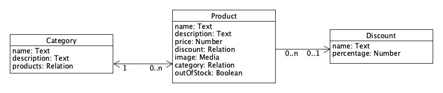

In chapter 1 we learned what a CMS was and how it could be used to manage the content of your website. In this chapter we are going to take a look at how we can get this information out of the system using a **Rest API**.

In the webshop-example folder you can find an example of a webshop built using Strapi. Start the project by executing the following terminal command from inside that directory.

```
npm install
npm run develop
```
If you open up the website in your browser (http://localhost:1337) you should be greeted by a webpage displaying all items that are in the store grouped by category. Some of the items are currently on sale, for those items a discount is applied. If an item is sold out it is possible for the owner to mark the item as out of stock. If this happens the price is hidden and instead the message "out of stock" is shown.

The data model of the application can be visualised as follows. Every **Category** can have any number of Products linked to it. A **Product** contains the information needed to display the product on the website, every product belongs strictly to one category or it won't be shown on the website. The *outOfStock* field is used to indicate that a product is temporarily unavailable. The *price* field contains the base price of the product. This is the price when no other conditions apply. In order to apply a discount to a certain product a link can be made from the product to the selected discount.

Log in to the admin panel of the store and toy around with the data until you feel confident that you have an idea of how the model works. Once you feel comfortable you can move over to the exercises section where you will see how to interact with the CMS via the api.


