Complete the following exercises by performing the postman call to retrieve the following information.

You can verify your solution by expanding the exercise, but please try to complete the exercise on your own first.

### Basic retrieval
---
To retrieve all entries for a specific collection you can make a GET api call to the "/api/\<collection-name\>" endpoint. In order to only retrieve a specific entry rather than all entries it is possible to make a get request to the "/api/\<collection-name\>/\<id\>" endpoint.
<details>
  <summary>
    1. Show all categories
  </summary>

  ```
  GET http://localhost:1337/api/categories
  ```
  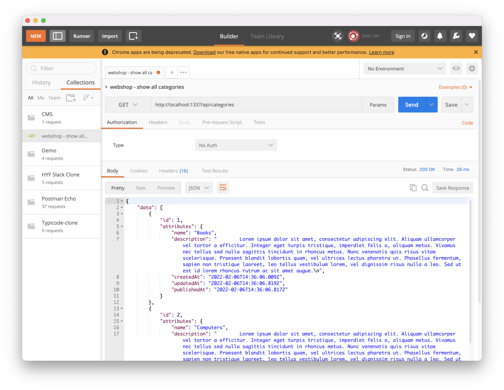
</details>

<details>
  <summary>
    2. Show all products
  </summary>

  ```
  GET http://localhost:1337/api/products
  ```
  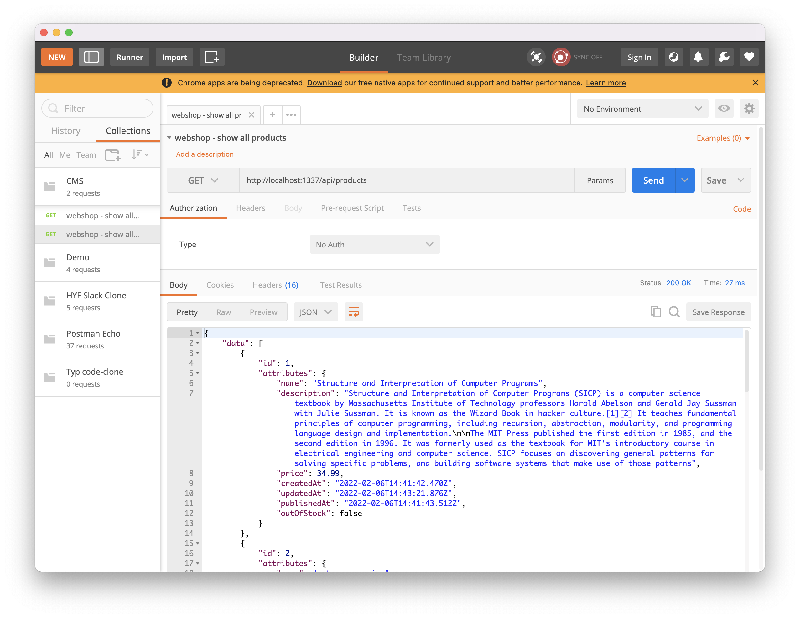
</details>

<details>
  <summary>
    3. Show the product with id 1
  </summary>

  ```
  GET http://localhost:1337/api/products/1
  ```
  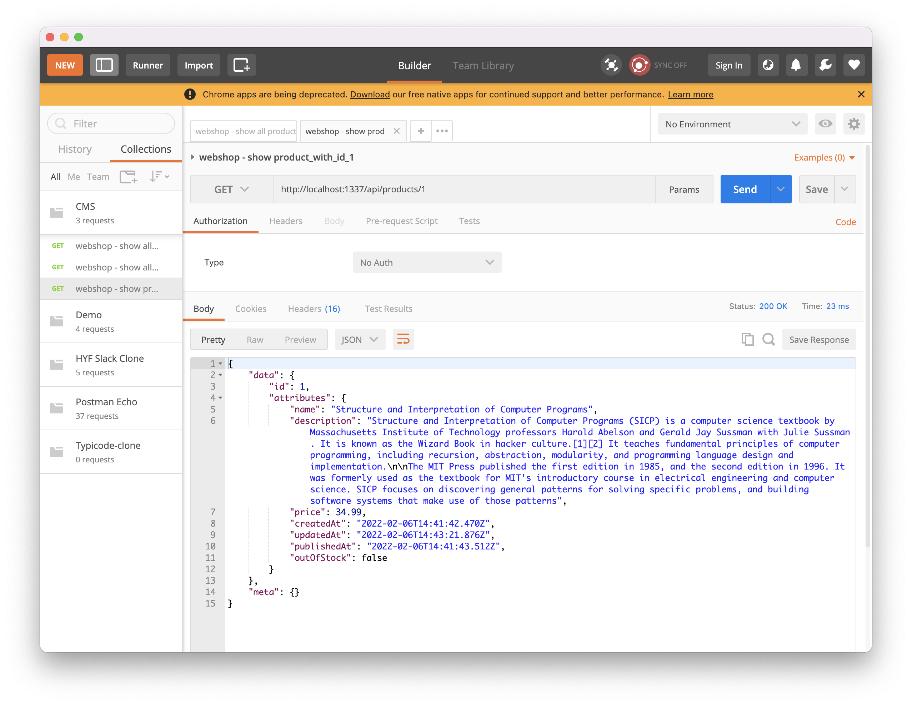
</details>

<details>
  <summary>
    4. Show the category with id 3
  </summary>

  ```
  GET http://localhost:1337/api/categories/3
  ```
  
</details>

<br>

### Field selection
---
Queries can accept a fields parameter to select only some fields. By default, only the following types of fields are returned:

 - String (string, text, richtext, enumeration, email, password, and uid)
 - Date (date, time, datetime, timestamp)
 - Number (integer, biginteger, float, decimal)
 - Generic (boolean, array, json)

For example if you only want to select 2 fields of a collection you can do so by adding "?fields[0]=attribute-one&fields[1]=attribute-2" to the request url.

<details>
  <summary>
    X. Show a list of all product names and prices
  </summary>

  ```
  GET http://localhost:1337/api/products?fields[0]=name&fields[1]=price
  ```
  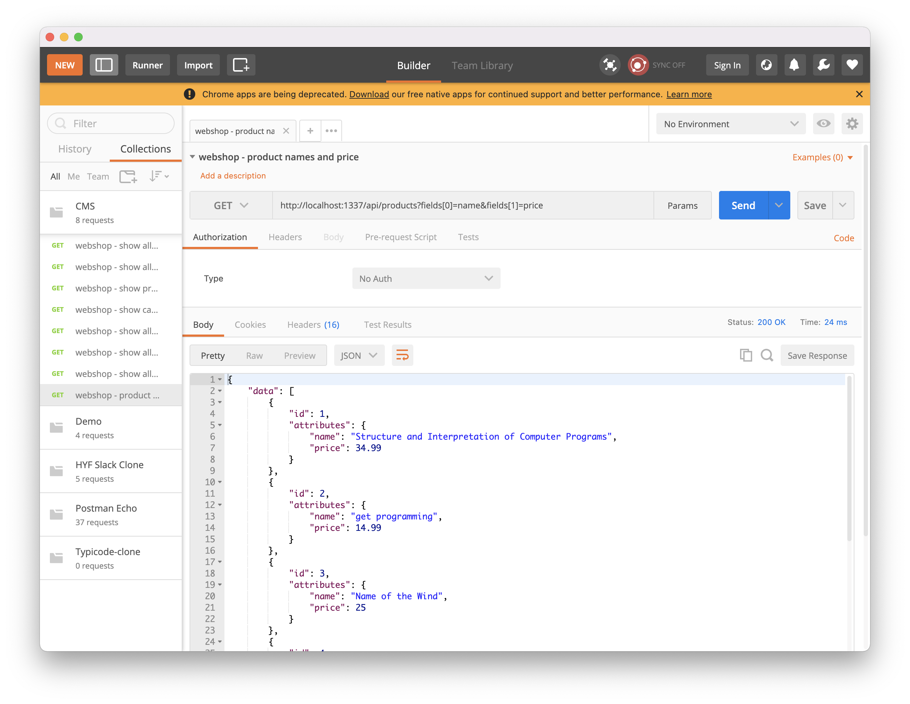
</details>

<details>
  <summary>
    X. Show the name of the product with id 2
  </summary>

  ```
  GET http://localhost:1337/api/products/2?fields[0]=name
  ```
  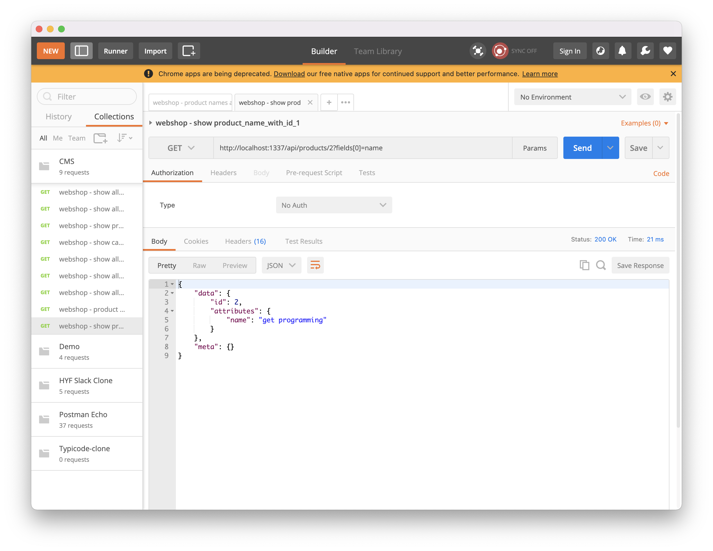
</details>

<details>
  <summary>
    X. Show the list of all names and descriptions of the categories
  </summary>

  ```
  GET http://localhost:1337/api/categories?fields[0]=name&fields[1]=description
  ```
  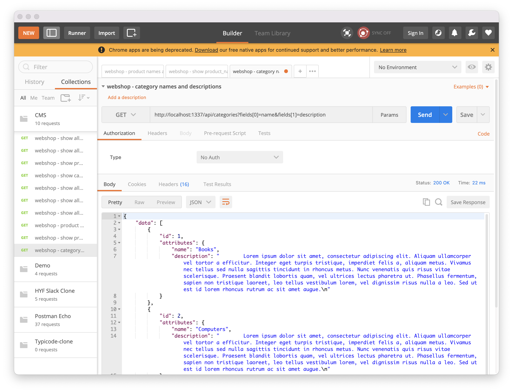
</details>

<br>

### Sorting
---
It is possible to tell Strapi to sort its response by adding a sort parameter to the query parameters (e.g. "/api/\<collection-name\>?sort=\<attribute-name\>"). To change the order of the sorting you can append :asc or :desc to the property name (e.g. "/api/\<collection-name\>?sort=\<attribute-name\>:desc"). If you ever need to sort based on multiple attributes you can do so by specifying their order using square brackets (e.g. "/api/\<collection-name\>?sort[0]=\<first-attribute-name\>:desc&sort[1]=\<second-attribute-name\>:asc").

<details>
  <summary>
    X. Show all products sorted by price (low to high)
  </summary>

  ```
  GET http://localhost:1337/api/products?sort=price
  ```
  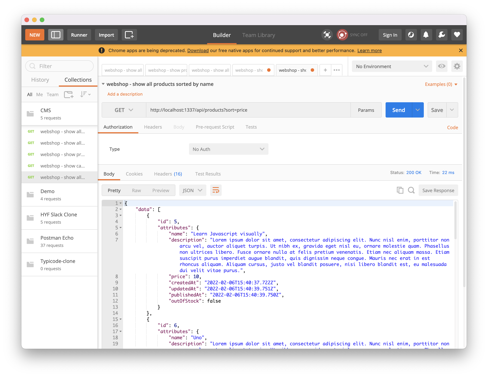
</details>

<details>
  <summary>
    X. Show all products sorted by price (high to low)
  </summary>

  ```
  GET http://localhost:1337/api/products?sort=price:desc
  ```
  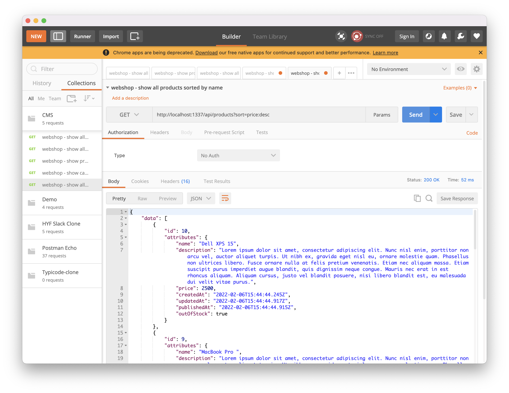
</details>

<details>
  <summary>
    X. Show all categories sorted by name
  </summary>

  ```
  GET http://localhost:1337/api/categories?sort=name
  ```
  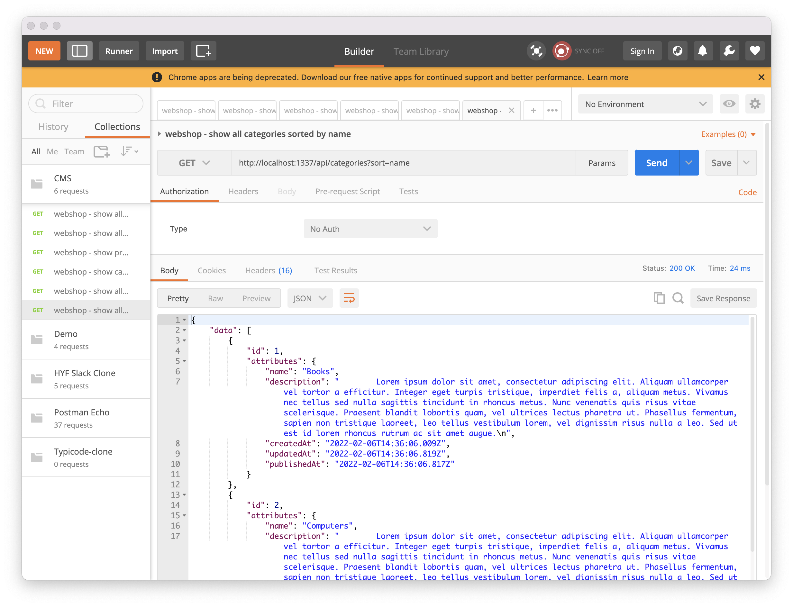
</details>

<details>
  <summary>
    X. Show all products sorted from new to old
  </summary>

  ```
  http://localhost:1337/api/products?sort=publishedAt:desc
  ```
  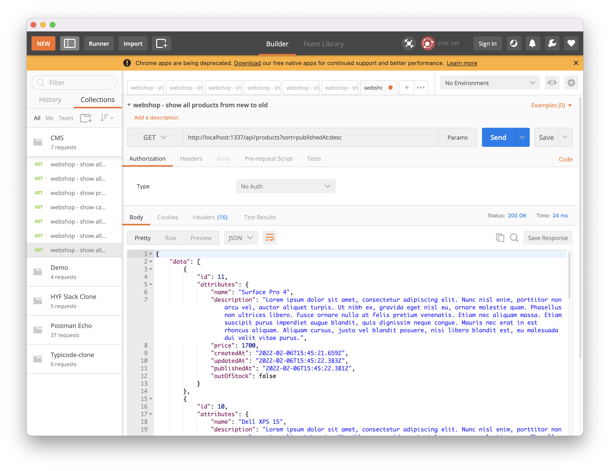
</details>

<br>

### Filtering
---
Queries can accept a filters parameter with the following syntax:

```
GET /api/<collection-name>?filters[field][operator]=value
```

The following operators are available

| Operator      | Description                              |
|---------------|------------------------------------------|
| $eq           | Equal                                    |
| $ne           | Not equal                                |
| $lt           | Less than                                |
| $lte          | Less than or equal to                    |
| $gt           | Greater than                             |
| $gte          | Greater than or equal to                 |
| $in           | Included in an array                     |
| $notIn        | Not included in an array                 |
| $contains     | Contains (case-sensitive)                |
| $notContains  | Does not contain (case-sensitive)        |
| $containsi    | Contains                                 |
| $notContainsi | Does not contain                         |
| $null         | Is null                                  |
| $notNull      | Is not null                              |
| $between      | Is between                               |
| $startsWith   | Starts with                              |
| $endsWith     | Ends with                                |
| $or           | Joins the filters in an "or" expression  |
| $and          | Joins the filters in an "and" expression |

<details>
  <summary>
    X. Show the list of products that cost more than 500 euros.
  </summary>

  ```
  GET http://localhost:1337/api/products?filters[price][$gt]=500
  ```
  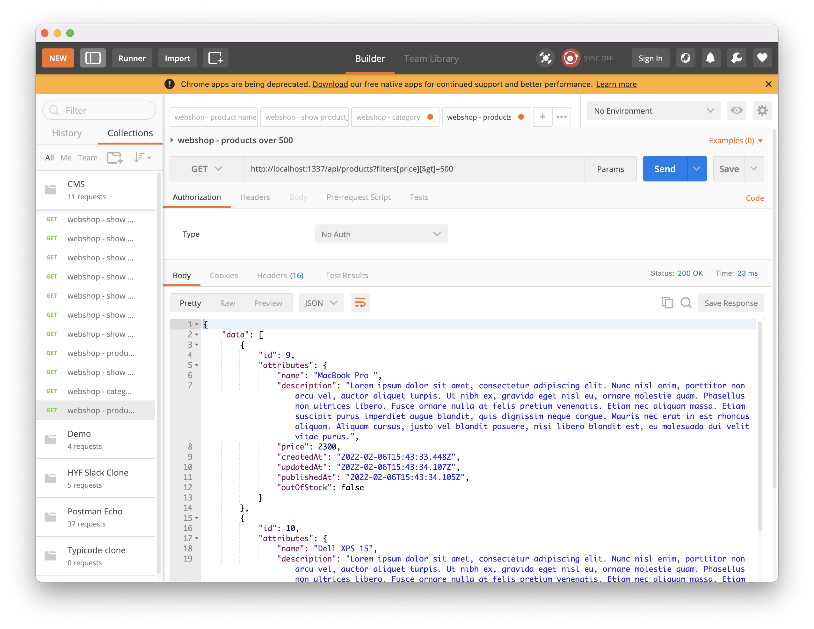
</details>

<details>
  <summary>
    X. Show the list of products that have a c in their name.
  </summary>

  ```
  GET http://localhost:1337/api/products?filters[name][$contains]=c
  ```
  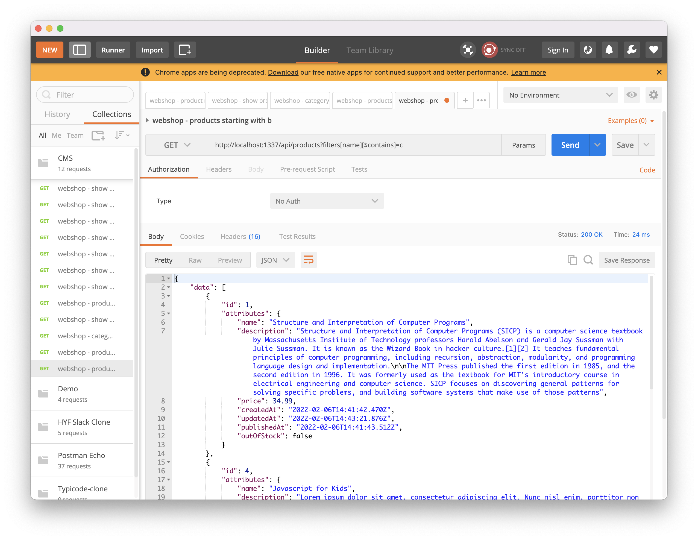
</details>

<br>

### Populate
---
By default relational, media, component, or dynamic zone fields are not pupulated by Strapi. In order to tell Strapi to populate a field you need to pass the fieldname as a query parameter (e.g. /api/products?populate=discount will not only load the list of projects but also their linked discounts). In order to tell Strapi to populate all first level fields it is possible to pass the wildcard '*' value.


Including nested relations can be tricky to do by hand. We will see tools to generate the right query strings programmatically in exercise 2 complex queries.

<details>
  <summary>
    X. Show the product with id 11 and include its discount.
  </summary>

  ```
  GET http://localhost:1337/api/products/11?populate=discount
  ```
</details>

<details>
  <summary>
    X. Show all categories and include their products.
  </summary>

  ```
  GET http://localhost:1337/api/categories?populate=products
  ```
</details>