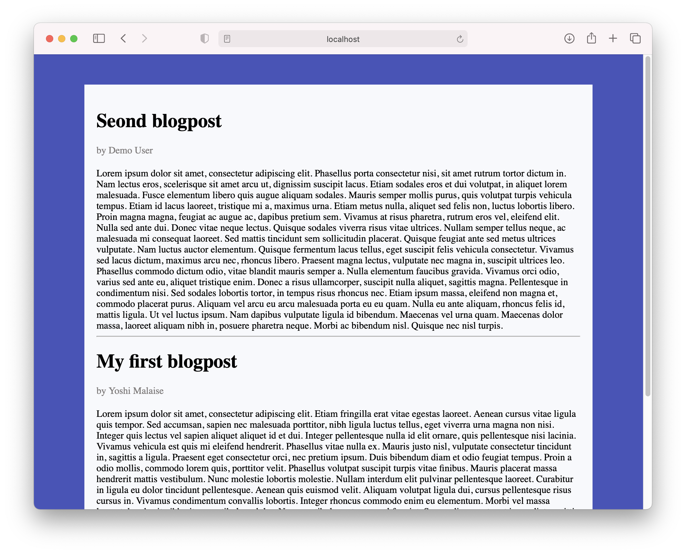
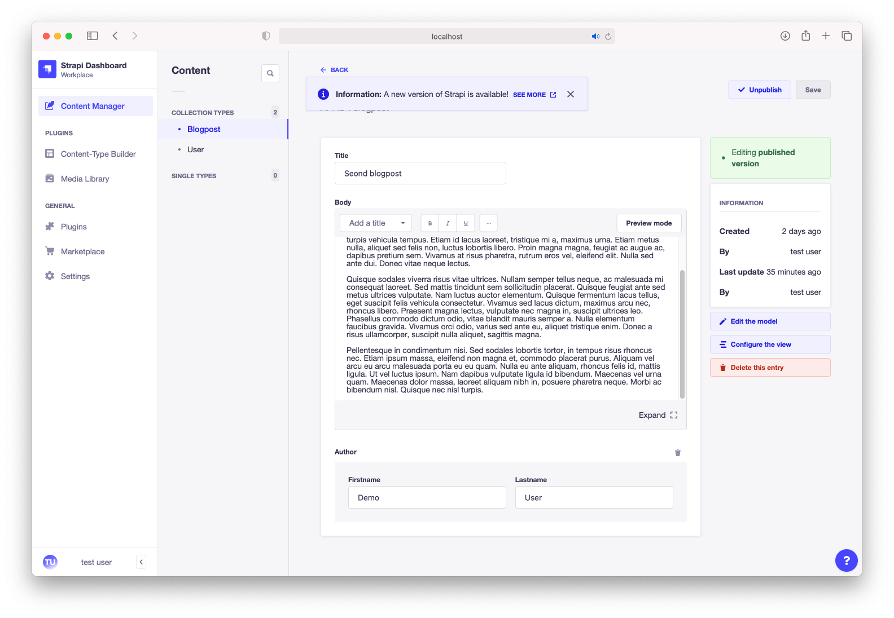

# Chapter 1 Intro 
## What is a CMS?
A CMS, or Content Management System, is an application that allows a company to manage, modify and publish content. This is important for companies in order to give them the freedom to change the content that is displayed on the webpage.

To see it in action we prepared an example for you in the blog-example directory. Open a terminal in the directory and start the server by executing the following command:

```
npm install
npm run start
```

If you see the following message that means the application started successfully:

```
To manage your project 🚀, go to the administration panel at:
http://localhost:1337/admin

To access the server ⚡️, go to:
http://localhost:1337
```

Opening your browser at http://localhost:1337 should display the following screen:

As you can see the website is a very simple blog that displays articles that contain a *title* and a *body*. Every blogpost is written by an *author*. Looking at the image however, we can spot a typo! The c is missing in the title "Second blogpost". Let's fix this!

Go to http://localhost:1337/admin to open up the admin panel. You will be asked to log in, for the examples in this module you can always use the username **testuser@localhost.com** and the password **Testuser1**. Once signed in you will be greeted by the following screen:


We want to make changes to the content, so let us select the **Content Manager** menu item in the left navigation menu. In the list of collection types we will select **Blogpost** as it is a blogpost we want to update. After doing this you should see the following overview of all blogposts that are currently in the system.


To update the second blogpost you can simply click the entry in the list to open the edit screen. Fix the typo in the title and press the save button at the top right screen to save your changes. Navigating to http://localhost:1337 again should now result in the webpage dislaying the corrected post, without having to change any code or redeploying anything!



We can even take it one step further, let's add a new blogpost. Go back to the list of blogposts (Content Manager > Blogpost) and click the **Create new entry** button on the top right corner of the screen. This should take you to a screen that is very similar to the edit blogpost screen. In here you can configure the title, author and body for your blogpost. However, after saving your new blogpost it will not yet be visible on the website. This is because all entries are first created in a **draft status**, giving you the change to revise and make changes before they are visible to the outside world. Once you are sure that you are happy with the post that you have written you can **publish** it by clicking the publish button at the top right corner of the page. Congratulations, your blogpost is now visible on the website!